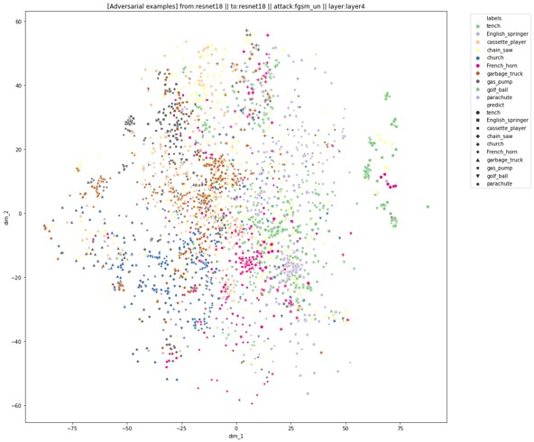
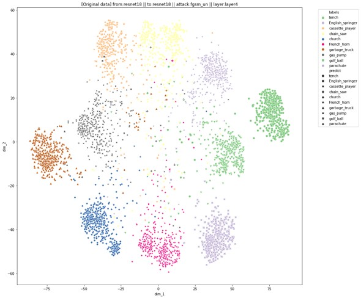
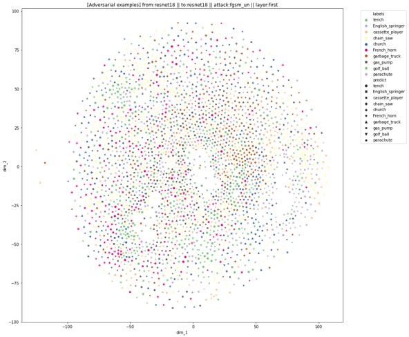
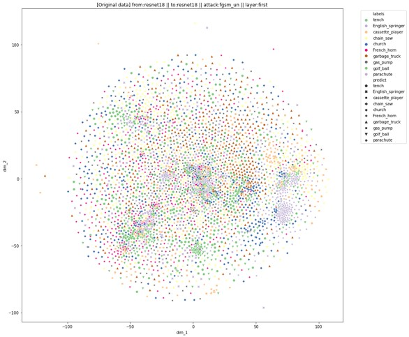

# Adversarial-attack-embedding-analysis
Analyze the embedding extracted from specific layers of models given adversarial examples via FGSM, PGD, MI-FGSM, and DeepFool algorithms.

## Introduction
This project is to investigate and elucidate which layer in the popular deep learning model architecture that is most vulnerable to the adversarial examples and lead to misclassification.
<br>
<br>





## Reproduce
1. Download ImageNette dataset from [link](https://github.com/fastai/imagenette). Or by
```script
wget https://s3.amazonaws.com/fast-ai-imageclas/imagenette2.tgz
```
2. Unzip the data in the folder of `./data/imagenette2/`
3. Process the images to smaller size.
```script
python3 process.py
```
4. Train (fine-tune) four models (ResNet-18, ResNet-50, DenseNet-121, Wide ResNet-50 v2)
```script
./train.sh
```
5. Generate adversarial examples. There are five scripts provided for adversarial examples generation. You should consider the computing resource you have to decide the generation order *to avoid cuda out of memory*
```
./generate_fgsm_un.sh
./generate_pgd_un.sh
./generate_pgd_ta.sh
./generate_mifgsm_un.sh
./generate_deepfool.sh
```
6. If you want to generate other type of adversarial examples, you can directly run the python script. You can revise `generate.py` for more choices.
```script
python3 generate.py --model_name $model --attack_name $attackname
```
7. To analyze the transferability of each kind of adversarial example. Please refer to `Transferability.ipynb`
8. To investigate the embedding of each layer, please refer to `Analysis attack resnet18.ipynb`, `Analysis attack resnet50.ipynb`, `Analysis attack densenet121.ipynb`, and `Analysis attack wide resnet50.ipynb`.
9. Several useful functions are provided for you to perform further analysis.